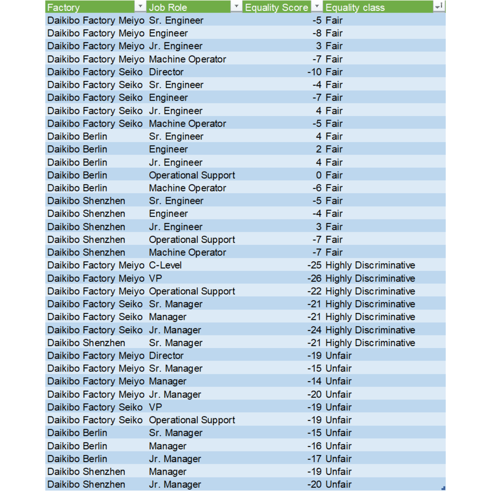

# Executive Summary: Corporate Equality Assessment Analysis

## Overview
The analysis was conducted on 37 observations covering:
* 4 factory locations
* 11 job categories
* Equality Scores ranging from +4 to -26
* 3 equality classifications: Fair, Unfair, and Highly Discriminative

The distribution of equality classifications is as follows:

| Classification | Count | Percentage |
| :--- | :--- | :--- |
| Fair | 19 | 51.4% |
| Unfair | 14 | 37.8% |
| Highly Discriminative | 4 | 10.8% |

Overall, more than half of all positions fall within the Fair category. However, inequality remains concentrated within managerial and executive-level roles.

---

## Key Findings

### 1. Equality Declines as Organizational Seniority Increases
Average Equality Score by job group:

| Job Group | Average Score |
| :--- | :--- |
| Engineering | -1.1 |
| Machine Operator | -6.3 |
| Operational Support | -12.0 |
| Management | -18.3 |
| Executive | -20.0 |

The 17.2-point gap between Engineering and Management indicates a significant decline in equality metrics as employees move into leadership positions.

### 2. Engineering Demonstrates the Strongest Equality Performance
All 12 Engineering positions (100%) are classified as Fair.

Key metrics:
* Average Jr. Engineer score: +3.5
* Average Engineer score: -4.3
* Average Sr. Engineer score: -2.5

No Engineering position falls into either the Unfair or Highly Discriminative categories. These results indicate a consistently equitable environment across technical functions.

### 3. Management Represents the Primary Equality Risk Area
Among the 12 management positions:
* 8 positions (66.7%) are classified as Unfair
* 4 positions (33.3%) are classified as Highly Discriminative
* 0 positions are classified as Fair

Lowest management scores:

| Position | Location | Score |
| :--- | :--- | :--- |
| Jr. Manager | Seiko | -24 |
| Sr. Manager | Seiko | -21 |
| Sr. Manager | Shenzhen | -21 |

All managerial roles fall below the Fair threshold of -10, indicating a systemic challenge within the management structure.

### 4. Executive Roles Exhibit the Highest Level of Inequality
The lowest scores across the organization are concentrated within executive positions:

| Position | Location | Score |
| :--- | :--- | :--- |
| VP | Meiyo | -26 |
| C-Level | Meiyo | -25 |

The executive group records an average Equality Score of -20.0, making it the lowest-performing segment in the organization.

---

## Factory-Level Analysis

| Factory | Average Score |
| :--- | :--- |
| Berlin | -5.5 |
| Shenzhen | -10.0 |
| Seiko | -12.8 |
| Meiyo | -14.4 |

### Berlin
* Best-performing facility overall.
* No positions classified as Highly Discriminative.
* Operational Support achieved a score of 0, representing perfect equality.

### Shenzhen
* Demonstrates balanced performance across operational roles.
* Operational Support and Machine Operator positions both scored -7.

### Seiko
* Contains the highest concentration of managerial inequality.
* Three management positions fall into the Highly Discriminative category.

### Meiyo
* Records the lowest overall average score.
* Contains the two lowest scores in the company (VP: -26, C-Level: -25).

---

## Improvement Priorities
Based on deviation from the Fair threshold (-10), the following areas should be prioritized:

| Priority | Area | Lowest Score |
| :--- | :--- | :--- |
| 1 | Executive Leadership (Meiyo) | -26 |
| 2 | Management Team (Seiko) | -24 |
| 3 | Operational Support (Meiyo) | -22 |
| 4 | Management Team (Shenzhen) | -21 |

---

## Conclusion
The analysis reveals four key patterns:
* Engineering is the strongest-performing function, with 100% of positions classified as Fair.
* Management and Executive roles represent the primary sources of inequality, with average scores of -18.3 and -20.0, respectively.
* Berlin demonstrates the highest level of equality performance, while Meiyo records the weakest results overall.

Improvement efforts should prioritize managerial positions, executive leadership, and Operational Support functions, as these groups account for the majority of Unfair and Highly Discriminative outcomes. The findings suggest that equality challenges are not evenly distributed across the organization but are concentrated within specific leadership and support functions. Targeted interventions in these areas are likely to deliver the greatest impact on overall organizational equality performance.
